# .NET 7 MVC Book store

## Description
📚 This repository contains a .NET 7 MVC project for a book store where users can browse and purchase books through PayPal. The project utilizes Microsoft SQL Server 2022 as the backend database. It incorporates various dependencies including Bootstrap 5.2.3 for front-end styling and Microsoft's ASP.NET Core Identity framework for authentication and authorization. Additionally, the project leverages Entity Framework Core for ORM functionalities.

## Preview UI
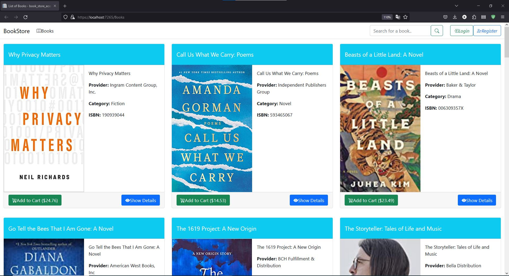
*Homepage Guest*

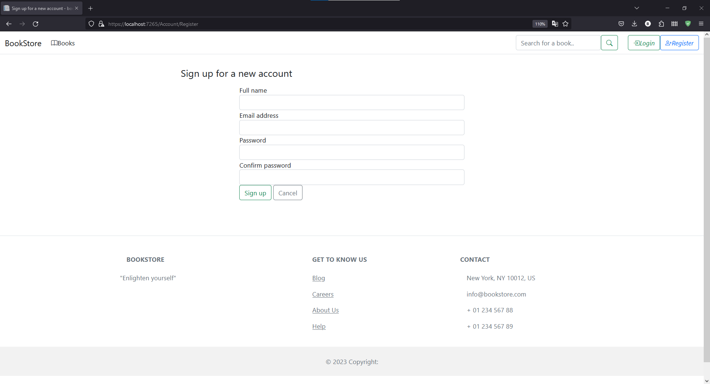
*Register*

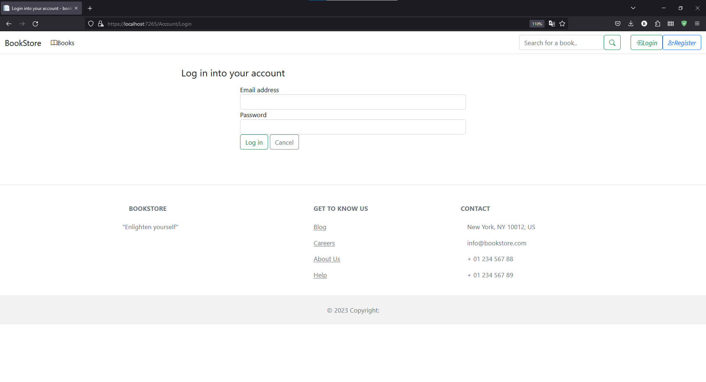
*Login*

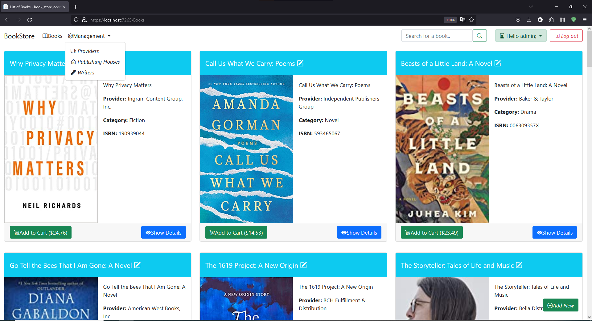
*Admin Homepage*

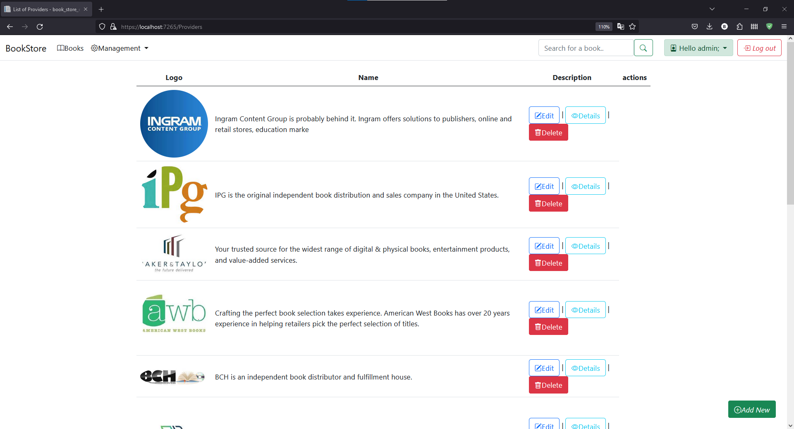
*Add Providers - only for admin*

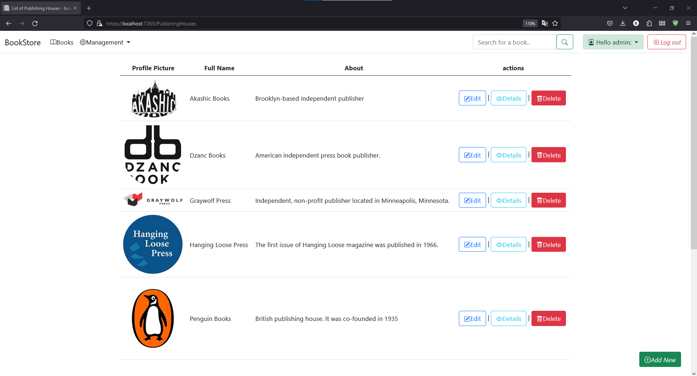
*Add Publishing Houses - only for admin*

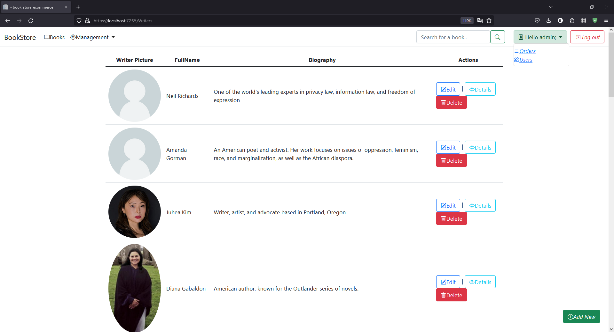
*Add Writers - only for admin*

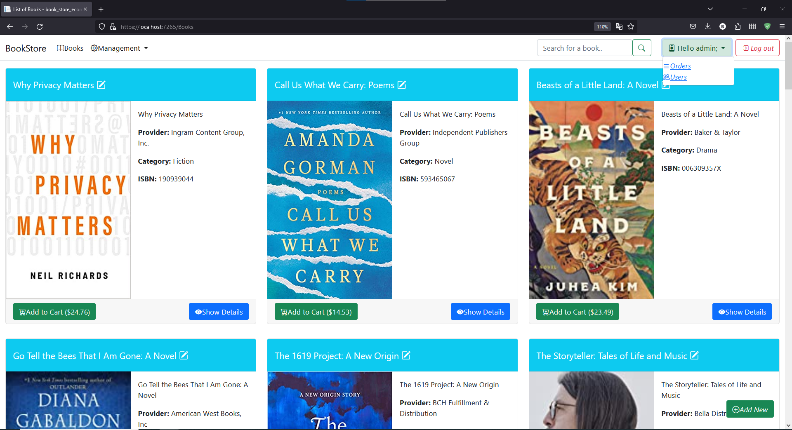
*Order and Users - only for admin*

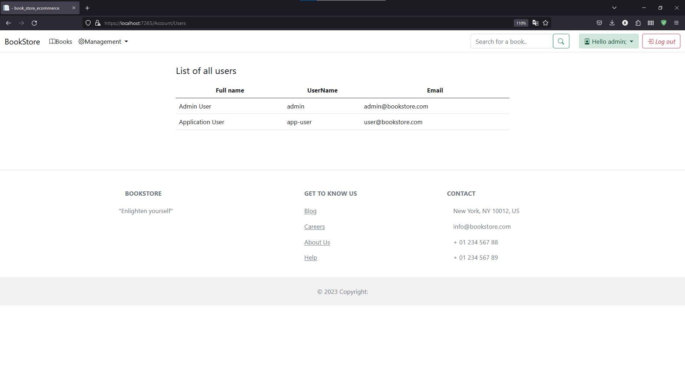
*See Users - only for admin*

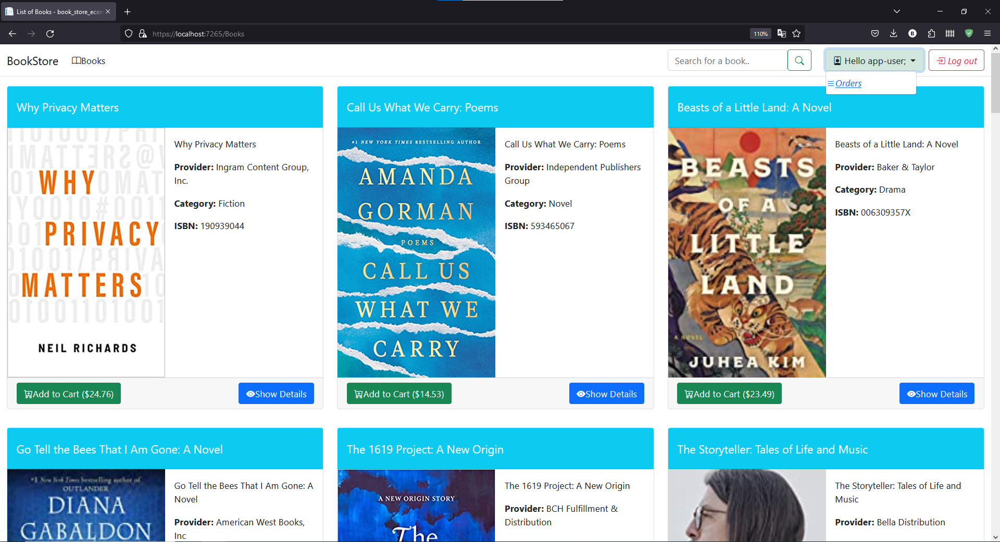
*User Homepage*

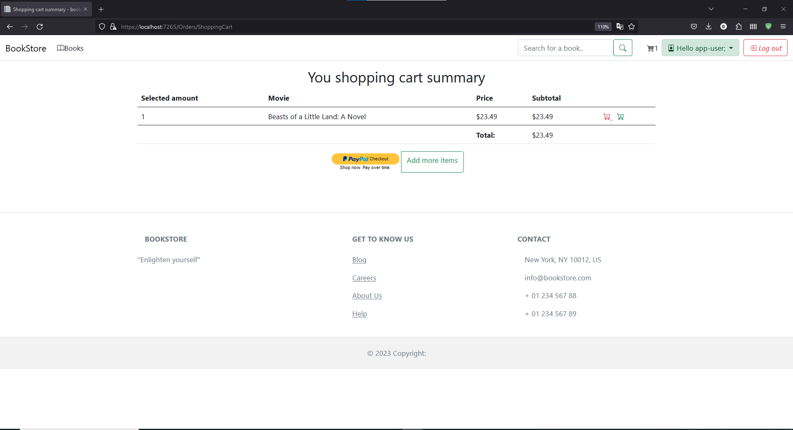
*User Shop cart*

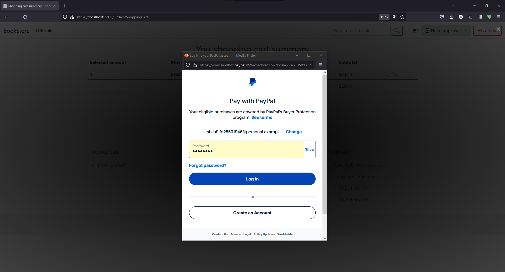
*User Checkout*

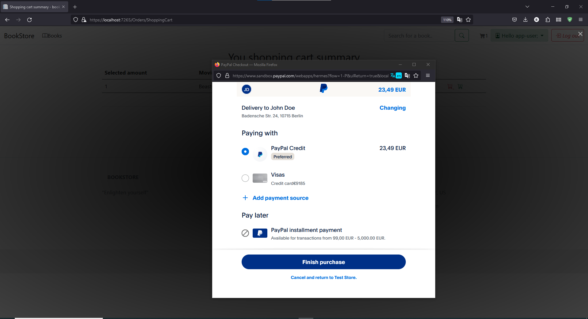
*User Purchase*

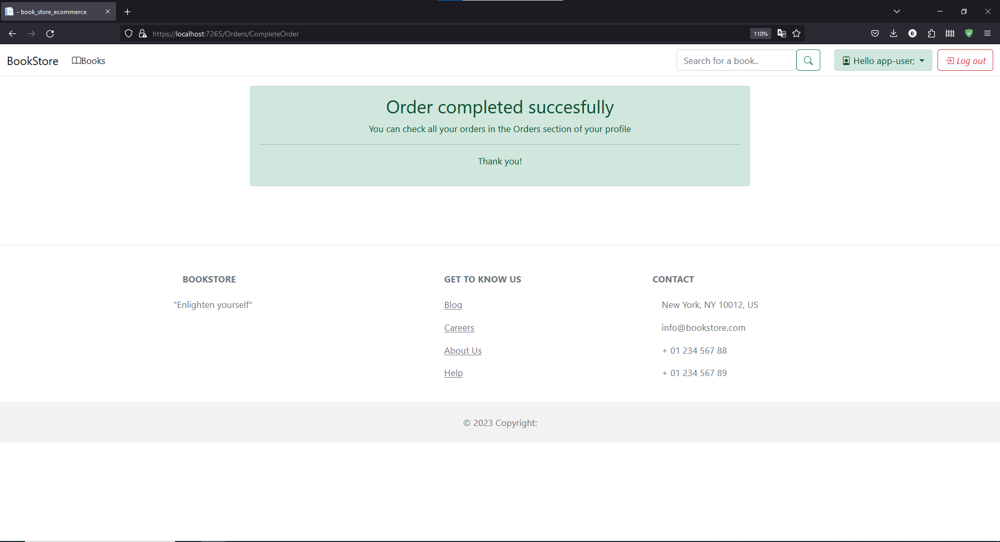
*Order Completed*

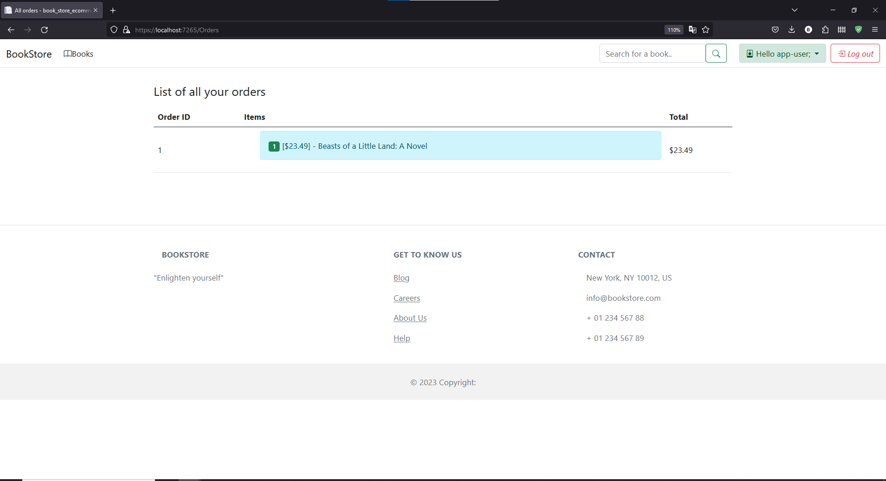
*History Orders*

## Database diagram
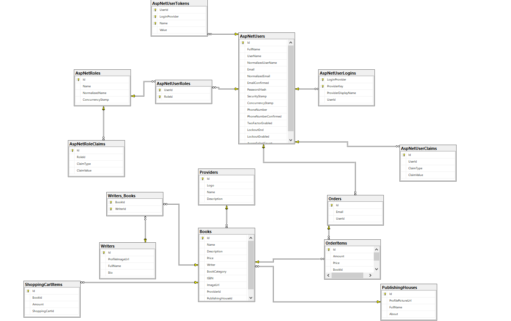
*Database Diagram*

## Prerequisites
Ensure the following prerequisites are installed on your system before running the project:
- [.NET 7 SDK x64](https://dotnet.microsoft.com/download/dotnet/7.0)
- [.NET 7 Runtime x64](https://dotnet.microsoft.com/download/dotnet/7.0)
- [Microsoft Visual Studio 2022](https://visualstudio.microsoft.com/downloads/)
- Install ASP.NET and web development workload from the Workloads tab in Visual Studio Installer
- [Microsoft SQL Server 2019](https://www.microsoft.com/en-us/sql-server/sql-server-downloads)
- [SQL Server Management Studio (SSMS)](https://docs.microsoft.com/en-us/sql/ssms/download-sql-server-management-studio-ssms?view=sql-server-ver15)

## Installation Steps
1. Download and install the .NET 7 SDK x64.
2. Download and install the .NET 7 Runtime x64.
3. Download and install Microsoft Visual Studio 2022.
4. During installation, make sure to select ASP.NET and web development workload from the Workloads tab.
5. Download and install Microsoft SQL Server 2019.
6. Install SQL Server Management Studio (SSMS).
7. Open Visual Studio 2022.
8. Select "Open a Project or Solution" and navigate to the directory containing the .sln file of the project.
9. In Visual Studio, go to View -> Server Explorer (or use Ctrl+Alt+S).
10. Right-click on Data Connections and select "Create New SQL Server Database".
11. Connect to the SQL Server instance using the following details:
    - Server Name: DESKTOP-PCCODE\SqlExpress (Replace "DESKTOP-PCCODE" with your actual server name)
12. From NuGet Tools, open NuGet Package Manager Console.
13. Create a migration using the command `Add-Migration <Name>`.
14. Update the database using the command `Update-Database`.
15. Run the application.

## Usage
1. After completing the installation steps, run the project in Visual Studio.
2. The application will start and be accessible via your web browser.

## Contributing
Contributions to the project are welcome. Feel free to open issues and pull requests.

## License
This project is licensed under the [MIT License](LICENSE).

## Contact
For any inquiries or support, please contact [your-email@example.com](mailto:your-email@example.com).
